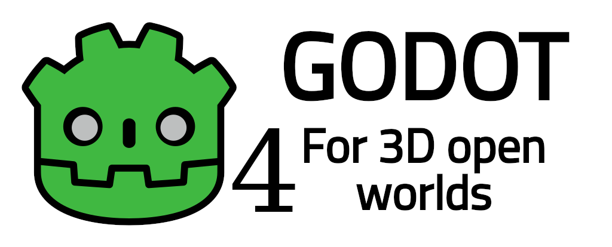

# Godot 4 for 3D open worlds

<p align="center">
    
</p>

This flavor of Godot 4.x engine is made to accommodate large open-world 3D games.

This fork is regularly synchronized with [4.x branch](https://github.com/godotengine/godot/tree/master).

Available for Windows x86-64, Linux x86-32 and x86-64, Linux ARM32 and ARM64, Android ARM32 and ARM64.

Implemented tweaks:
* Far plane (z-far) upper limit is set to 9e18 meters and tweaked for precision.
* [Large World Coordinates](https://docs.godotengine.org/en/stable/tutorials/physics/large_world_coordinates.html) are used when compiling (double precision floats).
* Increased editor zoom out distance to galactic scale (depth buffer must be adjusted for such scales, see below).
* Increased editor zoom increment for faster zooming.
* Implemented tweaks to mobile rendering backend to fix possible precision-related issues.
* This 4.x fork build DOES NOT implement hard-coded logarithmic depth buffer. You can implement it in your project shaders (see below).

Suggested:
* Use [logarithmic depth](https://outerra.blogspot.com/search?q=logarithmic&max-results=20&by-date=true) in your spatial shaders to achieve rendering at extreme distances
without z-fighting. Keep in mind that this may break some depth-related effects and shadow-casting.


```
// Add this before your vertex shader.
// Edit "Fcoef" to adjust for desirable view distance. Lesser number means further distance limit.
uniform float Fcoef = 0.001;
varying float gl_Position_z;

// Add this to your vertex shader.
void vertex()
{
	vec4 gl_Position = MODELVIEW_MATRIX*vec4(VERTEX, 1.0);
	gl_Position_z = gl_Position.z;
}

//Add this to your fragment shader.
void fragment()
{
	DEPTH = log2(max(1e-6, 1.0 -gl_Position_z)) * Fcoef;
}


```

* Use spatial shader material dithering for better de-banding on per-material basis when using Vulkan mobile renderer.

```
// Add this before your vertex shader.
// Edit "dither_darken" to adjust the brightness of dither pattern (optional).
uniform float dither_darken :  hint_range(0.5, 1.0, 5e-4) = 0.75;

const float dither_x = 172.7;
const float dither_y = 232.6;
const float dither_r = 105.5;
const float dither_g = 99.0;
const float dither_b = 110.0;

vec3 interleaved_gradient_noise(vec2 frag_coord) {
	vec3 dither = vec3(dot(vec2(dither_x, dither_y), frag_coord));
	dither.rgb = fract(dither.rgb / vec3(dither_r, dither_g, dither_b));
	return (dither.rgb - vec3(dither_darken)) / 255.0;
}

//Add this to your fragment shader.
void fragment()
{
	vec2 frag_coord = FRAGCOORD.xy;
	ALBEDO += interleaved_gradient_noise(frag_coord);
}


```


## Installation
Binaries available for Linux, Windows and Android.
You can download binaries and templates (debug) at [releases](https://github.com/roalyr/godot-for-3d-open-worlds/releases/).
You can build it from source. Refer to `rebuild_` scripts in root folder for convenience.

Reminder for cross-compiling for Windows:
```
To use posix mode for mingw by default:

$ sudo update-alternatives --config x86_64-w64-mingw32-gcc
<choose x86_64-w64-mingw32-gcc-posix from the list>
$ sudo update-alternatives --config x86_64-w64-mingw32-g++
<choose x86_64-w64-mingw32-g++-posix from the list>
```

<br/><br/>
<br/><br/>
<br/><br/>

# Godot Engine original readme

<p align="center">
  <a href="https://godotengine.org">
    
  </a>
</p>

## 2D and 3D cross-platform game engine

**[Godot Engine](https://godotengine.org) is a feature-packed, cross-platform
game engine to create 2D and 3D games from a unified interface.** It provides a
comprehensive set of [common tools](https://godotengine.org/features), so that
users can focus on making games without having to reinvent the wheel. Games can
be exported with one click to a number of platforms, including the major desktop
platforms (Linux, macOS, Windows), mobile platforms (Android, iOS), as well as
Web-based platforms and [consoles](https://docs.godotengine.org/en/latest/tutorials/platform/consoles.html).

## Free, open source and community-driven

Godot is completely free and open source under the very permissive [MIT license](https://godotengine.org/license).
No strings attached, no royalties, nothing. The users' games are theirs, down
to the last line of engine code. Godot's development is fully independent and
community-driven, empowering users to help shape their engine to match their
expectations. It is supported by the [Godot Foundation](https://godot.foundation/)
not-for-profit.

Before being open sourced in [February 2014](https://github.com/godotengine/godot/commit/0b806ee0fc9097fa7bda7ac0109191c9c5e0a1ac),
Godot had been developed by [Juan Linietsky](https://github.com/reduz) and
[Ariel Manzur](https://github.com/punto-) (both still maintaining the project)
for several years as an in-house engine, used to publish several work-for-hire
titles.


## Getting the engine

### Binary downloads

Official binaries for the Godot editor and the export templates can be found
[on the Godot website](https://godotengine.org/download).

### Compiling from source

[See the official docs](https://docs.godotengine.org/en/latest/contributing/development/compiling)
for compilation instructions for every supported platform.

## Community and contributing

Godot is not only an engine but an ever-growing community of users and engine
developers. The main community channels are listed [on the homepage](https://godotengine.org/community).

The best way to get in touch with the core engine developers is to join the
[Godot Contributors Chat](https://chat.godotengine.org).

To get started contributing to the project, see the [contributing guide](CONTRIBUTING.md).
This document also includes guidelines for reporting bugs.

## Documentation and demos

The official documentation is hosted on [Read the Docs](https://docs.godotengine.org).
It is maintained by the Godot community in its own [GitHub repository](https://github.com/godotengine/godot-docs).

The [class reference](https://docs.godotengine.org/en/latest/classes/)
is also accessible from the Godot editor.

We also maintain official demos in their own [GitHub repository](https://github.com/godotengine/godot-demo-projects)
as well as a list of [awesome Godot community resources](https://github.com/godotengine/awesome-godot).

There are also a number of other
[learning resources](https://docs.godotengine.org/en/latest/community/tutorials.html)
provided by the community, such as text and video tutorials, demos, etc.
Consult the [community channels](https://godotengine.org/community)
for more information.

[](https://www.codetriage.com/godotengine/godot)
[](https://hosted.weblate.org/engage/godot-engine/?utm_source=widget)
[](https://www.tickgit.com/browse?repo=github.com/godotengine/godot)
